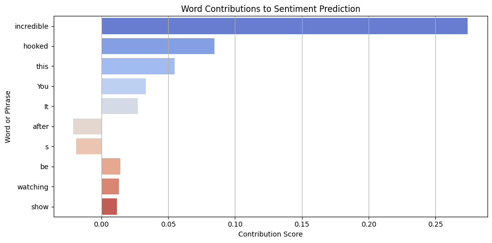

# 🎬 Fine-Tuning BERT for Sentiment Analysis on IMDb

This project fine-tunes the **BERT base model** (`bert-base-uncased`) for binary sentiment classification on the **IMDb Large Movie Review Dataset**, with post-hoc model interpretation using **LIME**.

Developed in **Google Colab**, using **TensorFlow** and **Hugging Face Transformers**.

---

## 📁 Overview

- **Dataset**: [IMDb Large Movie Review Dataset](https://ai.stanford.edu/~amaas/data/sentiment/)
- **Model**: BERT (base, uncased)
- **Task**: Sentiment Classification (Positive / Negative)
- **Tools**: TensorFlow, Hugging Face Transformers, LIME, Kaggle API
- **Environment**: Google Colab (GPU runtime recommended)

---

## 🚀 Running the Project (Colab Workflow)
1. Prepare the Project Directory.
   Download the DataCoach directory:
      - Open the link provided in the tf_model.h5_download file.
      - Download the file.
      - Place the downloaded file inside the sentiment_model directory.
     
2. Upload the full project folder to your Google Drive.

3. Open the notebook in Colab. It is structured into sequential steps (1–9).

4. For dataset access via Kaggle:
   - Download `kaggle.json` from [Kaggle API settings](https://www.kaggle.com/settings)
   - Place it in:  
     ```
     /DataCoach/kaggle.json
     ```
   - Run Step 2 in the notebook to download the dataset.

5. Run Steps 3–6.  
   Training (Step 6) is optional — a pre-trained model is provided.  
   - ⏱️ Training takes **at least 2 hours**, depending on your Colab runtime.

6. Model Results and Visualization:
   - Step 7 – Model interpretability using LIME.
   - Step 8 – Model evaluation.
   - Step 9 – Live interactive predictions.

---

## 📊 LIME Example

Sample LIME explanation for a review:




- Positive contributions: `incredible`, `hooked`, `this`
- Negative: `watching`, `show`

> Ref: [“Why Should I Trust You?” – Ribeiro et al. (2016)](https://arxiv.org/abs/1602.04938)  
> Tool: [`LIME`](https://github.com/marcotcr/lime)

---

## 🧰 Stack

- Python
- TensorFlow
- Transformers (Hugging Face)
- Google Colab
- Kaggle API
- LIME

---

## 📂 Structure

```text
project-folder/
├── README.md
├── DataCoach/
│   ├── Fine_tune_BERT_Model_for_Sentiment_Analysis.ipynb
│   ├── tf_model.h5_download
│   └── sentiment_model/
│       ├── config.json
│       ├── special_tokens_map.json
│       ├── tokenizer_config.json
│       └── vocab.txt
├── Assets/
│   └── lime_visualization.png
